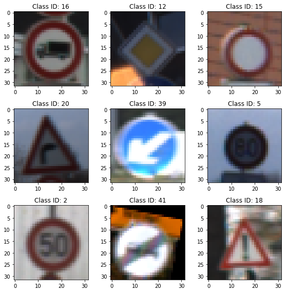

# **Build a Traffic Sign Recognition Classifier** 

## CarND-Term1 Project 2

### Author: Bugra Turan, 28.1.2018

---

**Build a Traffic Sign Recognition Project**

The goals / steps of this project are the following:
* Load the data set (see below for links to the project data set)
* Explore, summarize and visualize the data set
* Design, train and test a model architecture
* Use the model to make predictions on new images
* Analyze the softmax probabilities of the new images
* Summarize the results with a written report

---

### Reflection

### Overview

The structure of my program is listed as followed:
1) Loading of the train, validation, and test data sets
2) Visualization and statistics on the data
3) Preprocessing of the data by augmentation, grayscaling, and normalization
4) Definition of the neural network topology and creation of the training pipeline
5) Training and testing of the model
6) Analysis of the performance and accuracy on the test set
7) Testing the prediction accuracy on random images from the web by top 5 softmax comparison

### Data Set Summary & Exploration

#### 1. Basic summary of the data set.

I used the numpy library to calculate summary statistics of the traffic
signs data set:

* The size of training set is 34799
* The size of the validation set is 12630
* The size of test set is 4410
* The shape of a traffic sign image is 32, 32, 3
* The number of unique classes/labels in the data set is 43

#### 2. Exploratory visualization of the dataset.

Here is an exploratory visualization of the data set. It is a bar chart showing how the data ...

Number of class occurences in the training set.

Number of class occurences in the validation set.

It can already be seen that the class distribution between both sets differs. In general there are large differences in occurence between the classes up to a factor of 10.

### Design and Test a Model Architecture

#### 1. Preprocessing

Since the class distribution is so skewed image augmentation seemed to be a promising approach to lower this discrepancy. For this, i used the popular imgaug python library and defined a pipeline that uses (with a certain probability): rotation, scaling, translation, shearing, multiplication, contrast normalization and random pixel dropout. The augmentation was applied to all classes in the training set that have less than 500 samples. 

Example images from the as-is training set.

Example images after augmentation.

    
A class specific augmentation was also implemented but did not seem to have a large impact on the accuracy. Below you see the histogram of the training set after per-class-augmentation for classes with a sample set less than 500.

Number of class occurences in the augmented data set.

Afterwards, the data was converted to the grayscale and pixel normalization was applied since this stabilizes the neural network.

#### 2. Neural network architecture

The solution for the LeNet topology from the course was used as a starting point. From there on the network was modified as it was shown in the paper by Y LeCun. A diagram from the paper is shown below (all padding VALID):

Neural Network Model from Y LeCun.

A table of the realized network is listed in the following:

| Depth | Type | Input | Output | Parameters |
|:-----:|:----:|:-----:|:------:|:----------:|
| Layer 1 | Convolutional | 32x32x1 | 8x28x6 | shape=(5, 5, 1, 6) strides=[1, 1, 1, 1] |
| Layer 1 | Pooling | 28x28x6 | 14x14x6 | ksize=[1, 2, 2, 1], strides=[1, 2, 2, 1] |   
| Layer 2 | Convolutional | 14x14x6 | 10x10x16 | shape=(5, 5, 6, 16) strides=[1, 1, 1, 1] |
| Layer 2 | Pooling | 10x10x16 |5x5x16 |ksize=[1, 2, 2, 1], strides=[1, 2, 2, 1] |
| Layer 3 | Convolutional | 5x5x16 |1x1x400|shape=(5, 5, 16, 400) strides=[1, 1, 1, 1]|
| Layer 3 | Flatten | 5x5x16 |400 |-|
| Layer 3 | Flatten | 1x1x400 | 400 |-|
| Layer 3 | Concat  | 400 + 400 | 800|-|
| Layer 4 | Fully Connected | 800 | 43 | shape=(800, 43) |

Furthermore, a dropout was applied at each layer but tests have shown that here also the overall training accuracy decreased. Therefore, all keep_prob were set to rather qualitative values of:

keep_prob1 = 1 
keep_prob2 = 0.9
keep_prob3 = 0.8
keep_prob4 = 0.6

In general the dropout should be kept low at the first two layers.

#### 3. Training

The following training parameter were tested, examplarily: EPOCHS, batch size, dropout probabilities, and learning rate. A variable learning rate was also tested but seems to be not useful in this model. For optimization the AdamOptimizer from Tensorflow was used.

#### 4. Accuracy

With the used model it was quite easy to achieve a validation accuracy of around 95%. However, this was all done without augmentation, dropout, variable learning rate. All these optimizations lead to a decrease in accuracy down to the minimum required accuracy of 93%.

My final model results were:
Test Set Accuracy = 0.929
Validation Set Accuracy = 0.938
Train Set Accuracy = 0.993

A high accuracy on the training set but low accuracy on the validation set indicates over fitting.

### Testing the Model on New Images

Here are eight German traffic signs that I found on the web:

Image 1 top 5 are:
 Class ID: 11 100.00% Class ID: 30 0.00% Class ID: 27 0.00% Class ID: 21 0.00%.

Image 2 top 5 are:
 Class ID: 0 100.00% Class ID: 1 0.00% Class ID: 5 0.00% Class ID: 6 0.00%.

Image 3 top 5 are:
 Class ID: 12 100.00% Class ID: 40 0.00% Class ID: 9 0.00% Class ID: 35 0.00%.

Image 4 top 5 are:
 Class ID: 38 100.00% Class ID: 34 0.00% Class ID: 29 0.00% Class ID: 0 0.00%.

Image 5 top 5 are:
 Class ID: 34 100.00% Class ID: 38 0.00% Class ID: 30 0.00% Class ID: 21 0.00%.

Image 6 top 5 are:
 Class ID: 18 100.00% Class ID: 26 0.00% Class ID: 24 0.00% Class ID: 27 0.00%.

Image 7 top 5 are:
 Class ID: 25 98.17% Class ID: 24 1.81% Class ID: 22 0.02% Class ID: 29 0.00%.

Image 8 top 5 are:
 Class ID: 3 99.99% Class ID: 11 0.01% Class ID: 0 0.00% Class ID: 31 0.00%.

The model was able to correctly guess 6 of the 8 traffic signs, with the other two images predictions above 98% confidence for the correct label. This is in my opinion fairly good. 

### Outlook
Since there are many hyperparameters there needs to be a good optimizer that adjusts the parameters in an optimal way. The approach here was to brute-force different behaviors of the EPOCHS etc. to increase the networks performance. I am sure that an optimizer can reach better or similar performances but most likely much faster. Maybe a neural network that optimizes the training of other neural networks? ;-)

A second point would be a more sophisticated image augmentation. The imgaug library offers many image processing techniques and sequences. There is much room for improvement but also hidden traps with processing the could be even counter-productive.